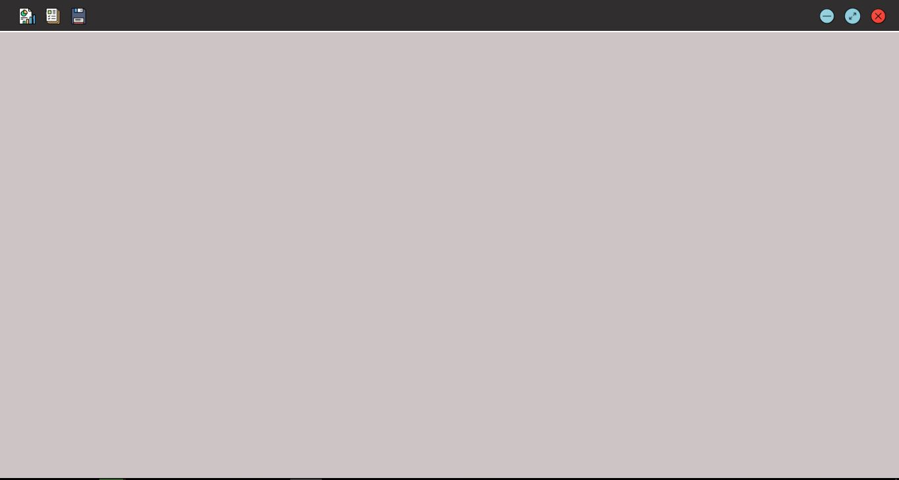
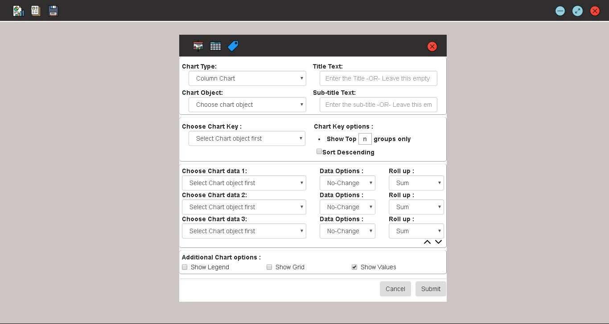
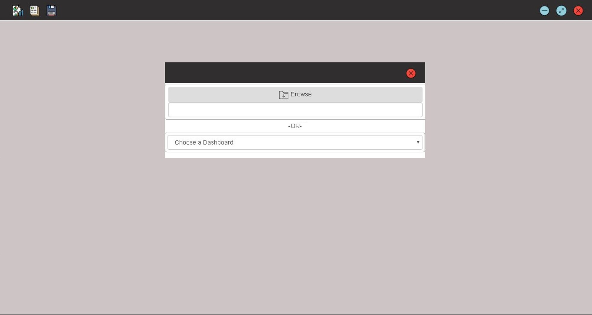
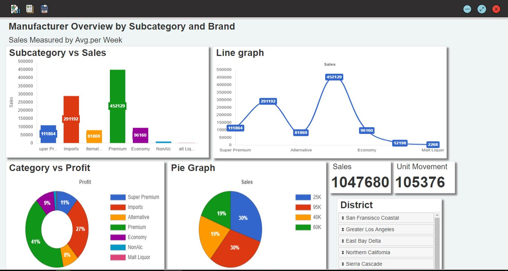

# Dashboard Creator Application #
This is a Electron JS Application that lets users create customized dashboards for their data.
## How to set up ##
- Just run Setup.exe to install the application on you computer.
> Note -> This setup is only for windows 64 bit version. Also I haven't made certificates for the application, so windows defender will show Security warnings.
- or in Sorce_Code folder npm command to start the application
```sh
$ npm start
```
------
## Source code ##
The source code contains :
- __main.js__ - Electron apps main file. This is what calls the other html files.
- __src/index.html__ - The starting page of the application.
- __src/open_new.html__ - Upload new data or load previously created dashboards.
- __src/tools_tab.html__ - Tools menu which includes options to create charts, tables, notes etc.
- __src/main_js.js__ - Contains all the main js scripts belonging to index.html
- __src/chart_creator.js__ - Contains all js scripts on chart creation
- __src/table_creator.js__ - Contains all js scripts on table creation

## Dependencies or  open-source frameworks used ##
- Electron JS
- SQLite
- Bootstarp
- jQuery
- jQuery UI
- Chart JS

## Some Screenshots of the application ##
- Home Screen of the app(Opens with a black dashboar).

- Tools Menu of the application

- Add new data or open already created dashboards menu.

- Dashboard Example
